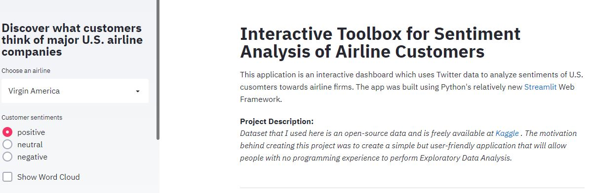
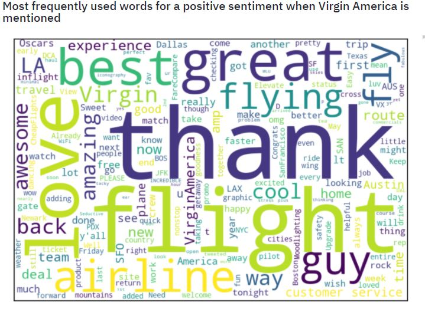
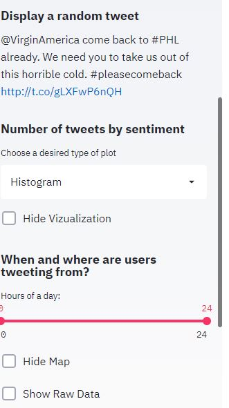
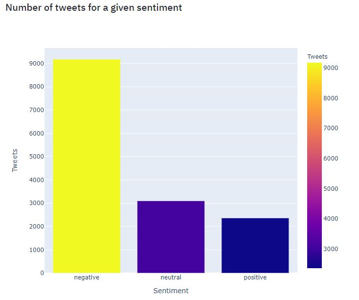
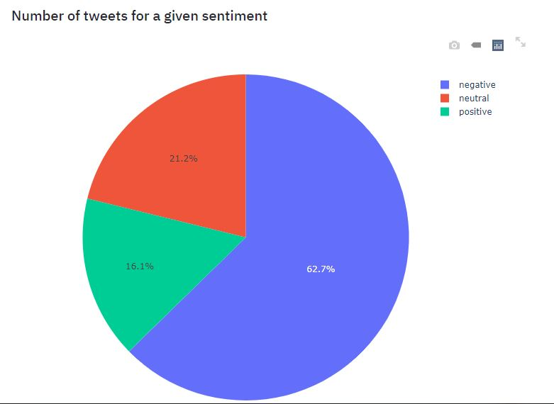
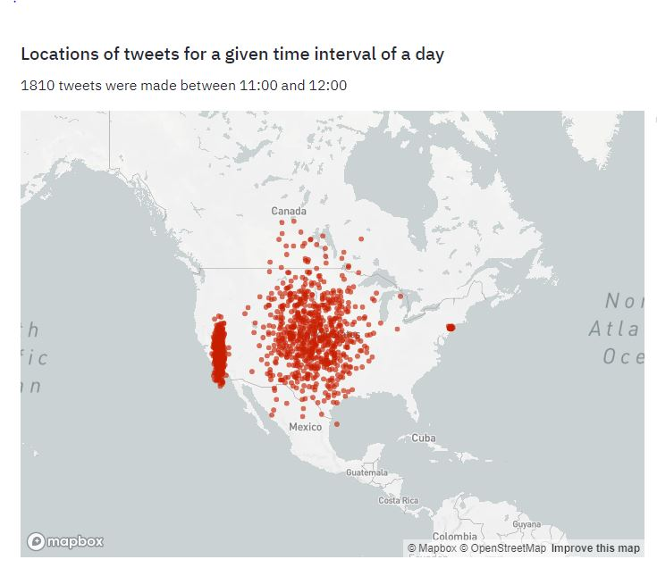
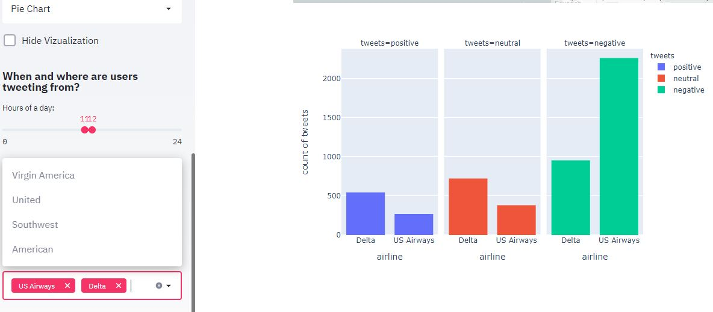

# Interactive-Toolbox-for-Analyzing-Customer-Sentiments-Towards-Airlines

 
#### Background info: This idea of working through this project, as well as associated practical guidelines were taken thanks to Coursera's [Create Interactive Dashboards with Streamlit and Python](https://www.coursera.org/projects/interactive-dashboards-streamlit-python) for which I earned a certificate of accomplishement for completing it.

**Comments regarding app.py:**

1. This application is an interactive dashboard which uses Twitter data to analyze sentiments of U.S. cusomters towards major airline firms. 
The app was built using Python's <a href="https://streamlit.io"> Streamlit </a> Web Framework. 

  

    Dataset that I used here is an open-source data and is freely available at 
    <a href="https://www.kaggle.com/crowdflower/twitter-airline-sentiment"> Kaggle </a>.
    The motivation behind creating this project was to create a simple but user-friendly application that will allow people
    with no programming experience to perform Exploratory Data Analysis.
  

    

2. **In order to run the app:**	

	- Open a terminal 	

	-  If current working direcotry is different, then navigate to the directory where app.py is stored
	
	- Type `streamlit run app.py`

	
3. The list of all libraries and their respective versions that were used to create this project is given in **requirements.txt** file. Please refer to it in case of a necessity.

<b>Below are given some actual screenshots showing how the web app looks like when it is displayed in the browser.</b>

<b>Note:</b> They were taken using Windows Snipping Tool, so the quality might not be the best. But at least this gives an overall picture of how the dashboard app looks like.

 

 

 

 

 

 

